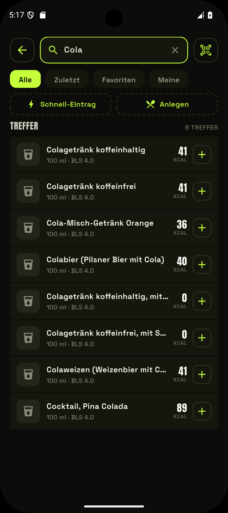
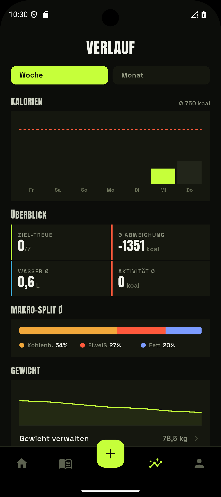

<div align="center">


# EasyTrack

**A private, local-first calorie &amp; hydration tracker.**
Offline German food database, barcode scanning — no account, no ads, no subscription.

[](https://github.com/windowsaft/easytrack/actions/workflows/ci.yml)
[](LICENSE)

[](https://github.com/windowsaft/easytrack/releases/latest)

</div>

---

## Why EasyTrack

Most trackers want an account, a subscription, and your data. EasyTrack wants none of that.

- **Local-first** — everything lives on your device; there's no server to sign up for.
- **No account, no ads, no subscription** — by design, not as an upsell.
- **Works offline** — search runs against a bundled German food database, not a network call.
- **Bilingual &amp; translatable** — English and German, and anyone can add a language without touching code.
- **Source-available** — GPLv3; study it, build it, fork it.

## Features

| Feature | |
|---|---|
| **Diary** | Four meals a day, calories + macros, edit weights after logging |
| **Hydration** | Water logging against a daily goal |
| **Activity** | Manual calorie-burn entries with a configurable safety factor; optionally added to your budget |
| **Search** | Offline-first over the German BLS database + an Open Food Facts slice, with an online fallback cached locally |
| **Barcode scanning** | Camera scan resolved against the on-device product pack, then online |
| **Custom foods &amp; recipes** | Build a recipe from ingredients, then log the portion you actually weighed |
| **Targets** | TDEE via Mifflin–St Jeor, always manually overridable — history-preserving |
| **History** | Week/month trends: calories vs. budget, adherence, macro split, weight |
| **Backup** | Export/import the whole database as a zip — your data, portable |

All data is stored locally. The schema is sync-ready, so a server can be added later without a painful migration.

## Install

EasyTrack is distributed as a signed Android APK on the
**[Releases page](https://github.com/windowsaft/easytrack/releases/latest)** — download it and open it
to install (you may need to allow installs from your browser or file manager). Because sideloaded
installs get no store auto-update, the app checks GitHub and shows a hint in **Settings** when a newer
version is out.

> Product data (Open Food Facts) is downloaded on first run and refreshed periodically, so the food
> database stays current without shipping a new app.

## Screenshots

<!-- Add screenshots here, e.g.:
<p align="center">
  
  
  
</p>
-->

_A full walkthrough with screenshots lives in the project wiki._

## Development

Requires **Flutter 3.44+** and **Node.js 20+** (for the food-data ETL under `tools/etl/`).

```bash
flutter pub get
flutter test        # unit + widget tests
flutter run         # launch on a device/emulator
```

Generated code (drift, localizations) is produced on build. If analysis complains about missing
generated files, run:

```bash
flutter gen-l10n
dart run build_runner build --delete-conflicting-outputs
```

## How it's built

- **Flutter** UI, **Riverpod** for state/DI, **drift** over **SQLite** for local storage.
- **Local-first, sync-ready** schema (soft-deletes, history-preserving targets).
- **fl_chart** for the history/weight charts; **mobile_scanner** for barcodes.
- A Node **ETL** (`tools/etl/`) builds the bundled BLS pack and the downloadable Open Food Facts
  packs; a small Docker service (`tools/etl/pack-builder/`) rebuilds and publishes them on a schedule.
- CI runs analyze + tests + a debug APK build, plus the ETL suite, on every push.

## Translations

EasyTrack ships in English and German and is built to be translated by anyone — no coding required.
All UI text lives as plain JSON under [`lib/l10n/`](lib/l10n), one file per language. To add or correct
a language, see **[docs/translating.md](docs/translating.md)**. A self-hosted Weblate instance
(web-based, no Git) is planned to make this even easier.

## Data sources &amp; attribution

### Bundeslebensmittelschlüssel (BLS) 4.0

Generic German food data comes from the BLS, licensed under
[CC BY 4.0](https://creativecommons.org/licenses/by/4.0/deed.de).

> Max Rubner-Institut (2025): Bundeslebensmittelschlüssel (BLS), Version 4.0 –
> Deutsche Nährstoffdatenbank. Karlsruhe.
> DOI: [10.25826/Data20251217-134202-0](https://doi.org/10.25826/Data20251217-134202-0)

### Open Food Facts

Branded and barcode product data comes from [Open Food Facts](https://openfoodfacts.org),
made available under the [Open Database License (ODbL)](https://opendatacommons.org/licenses/odbl/1-0/).
Product images are not used.

### USDA FoodData Central

Planned as an additional source. Public domain.

## License

The **source code** is licensed under the [GNU General Public License v3.0](LICENSE):
you're free to use, study, modify, and redistribute it, but derivative works must stay
open source under the same license.

The **bundled food data is not covered by the GPL** — it keeps the licenses noted above:
BLS 4.0 under [CC BY 4.0](https://creativecommons.org/licenses/by/4.0/) and Open Food
Facts under the [ODbL 1.0](https://opendatacommons.org/licenses/odbl/1-0/). Redistributing
the data carries those obligations (attribution, plus share-alike for the Open Food
Facts-derived pack).
